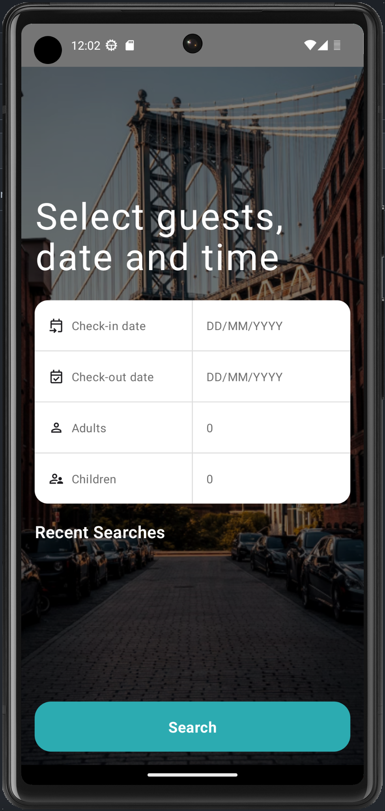
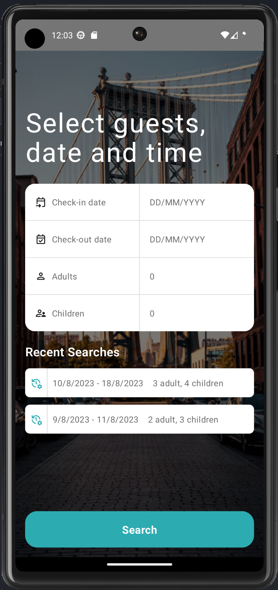
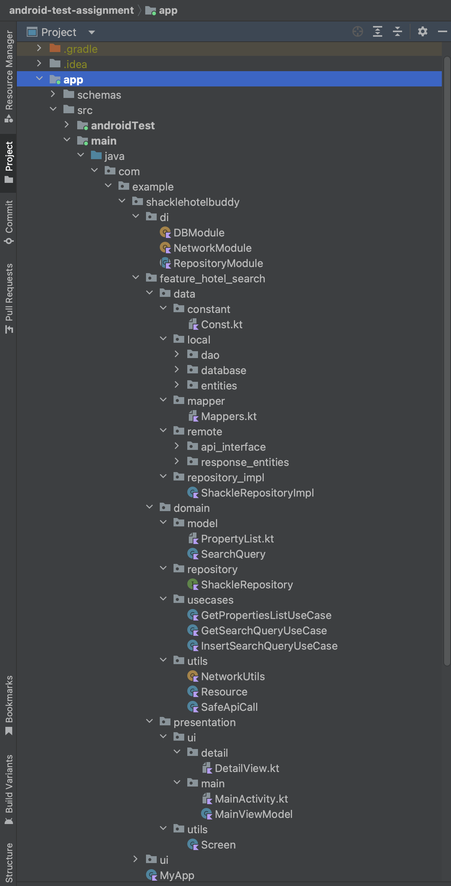

# android-test-assignment
Template project for Shackle Android interview assignment

ScreenShot 1               |  ScreenShot 2
:-------------------------:|:-------------------------:
  |  

### Tech stack & Open-source libraries
- Minimum SDK level 24 to latest
- Written in [Kotlin](https://kotlinlang.org/)
- Implementing MVVM design pattern with Android Architecture Components by following clean architecture principles.
- Dependency injection with [Hilt](https://developer.android.com/training/dependency-injection/hilt-android)
- Consuming a Hotel's API of [Hotel API](https://www.rapidapi.com/apidojo/api/hotels4)
- Safe API call with [Retrofit](https://github.com/square/retrofit) & [Coroutines](https://kotlinlang.org/docs/coroutines-overview.html)
- Caching API response with [OkHttpClient](https://square.github.io/okhttp/4.x/okhttp/okhttp3/-ok-http-client/) from [medium article](https://medium.com/@bapspatil/caching-with-retrofit-store-responses-offline-71439ed32fda)
- Observing data changes and updating the UI state with [StateFlow](https://kotlinlang.org/api/kotlinx.coroutines/kotlinx-coroutines-core/kotlinx.coroutines.flow/-state-flow/)
- [Stetho](https://github.com/facebook/stetho) to check API response directly on Brave web browser.
- Used [Jetpack Compose](https://developer.android.com/jetpack/compose) in one of the module with [Material 3 UI](https://m3.material.io/develop/android/jetpack-compose)
- [Room Database](https://developer.android.com/training/data-storage/room)- Constructing SQLite database more easily
- [Jetpack](https://developer.android.com/jetpack) libraries
    - [Navigation](https://developer.android.com/guide/navigation) - Handling navigation between destinations within the app
    - [Jetpack Compose](https://developer.android.com/jetpack/compose)
    - [Lifecycle](https://developer.android.com/topic/libraries/architecture/lifecycle) - Handling lifecycles with lifecycle-aware component
    - [ViewModel](https://developer.android.com/topic/libraries/architecture/viewmodel) - Storing and managing UI-related data in a lifecycle-conscious way
    - [Hilt](https://developer.android.com/training/dependency-injection/hilt-android) - Injecting dependencies
- [Kotlin Coroutines](https://kotlinlang.org/docs/coroutines-overview.html) - Allowing asynchronous programming with Kotlin
- [Retrofit](https://github.com/square/retrofit) - Interacting with the REST API
- [OkHttp](https://github.com/square/okhttp) - Implementing interceptors
- [Gson](https://github.com/google/gson) - Converting JSON to Kotlin data class
- [Glide](https://github.com/bumptech/glide) - Loading and caching images
- [Glide Transformations](https://github.com/wasabeef/glide-transformations) - Providing image transformations for Glide
- [Glide Compose Image](https://bumptech.github.io/glide/int/compose.html) - Loads image directly from compose.
- [Robolectric](https://robolectric.org/) for Unit testing
- [Espresso](https://developer.android.com/training/testing/espresso) for UI testing
- [Mockito](https://site.mockito.org/) mocking framework for unit tests

### Some Demo app Features
- Search Hotel as per Check-In Date, Check-out Date, Adult, Children
- Save Search Previous query in Offline
- Offline app support (if cached data is available)

## Demo App Structure

- androidTest (Instrumentation Tests Compose UI, Espresso and Hilt Test Lib)
- debug (HiltTestActivity for UI tests)
- main
- sharedTest (directory act as bridge between unit and instrumentation tests. It contains files like Fake Hilt Modules, fake Repository, Hilt Test Runner)
- test (Unittest cases Robolectric, Mockito and Hilt)

The project is structured into three distinct layers that have been designed to address concerns related to Separation of Concerns and Testability.
- Data
- Presentation
- Domain

### Data
The first layer is the Data layer, which is responsible for managing the application data that is fetched from either the network or the local database.
 This layer consists of four packages
- `local` : The local package comprises the Room components that are used to fetch data from the local database.
- `mapper` : The mapper package contains mapping functions to map the data retrieved from various sources to domain models.
- `remote` : The remote package comprises the Retrofit components used to fetch data from the network source.
- `repository` : The repository package contains the implementations of repository interfaces defined in the domain layer.

### Presentation
The second layer is the Presentation layer, which is responsible for rendering the application data on the screen.
 
- `ui` : The ui package comprises Activities and Compose View with their corresponding ViewModel classes.

### Domain
The third and central layer of the project is the Domain layer.
This layer acts as a bridge between the data and presentation layers, retrieving data from the former and exposing it to the latter.
The Domain layer is independent of other layers, which means that changes in other layers do not affect it.
 The Domain layer consists of three packages
- `model` : The model package contains data classes that hold the data retrieved from the data layer, to be used later on in the presentation layer to expose it to the UI.
- `repository` : The repository package contains repository interfaces that abstract the domain layer from the data layer.
- `usecase` : The usecase package contains use cases that handle the business logic, which can be reused by multiple ViewModels.

## Try the App
Check out & install the app <a href="apk/app-debug.apk">APK file<a/> to try the app.
